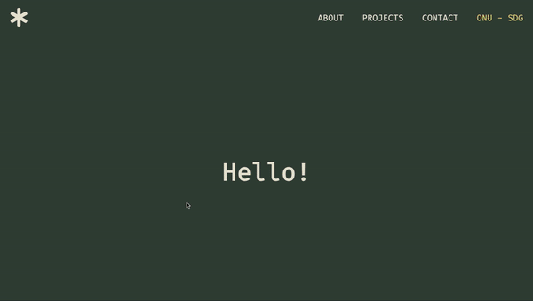

## Portfólio

<i>Projeto desenvolvido como desafio final referente ao módulo 2 do curso Vai na Web de desenvolvimento front-end. </i>  

    
    
    
    

 

O presente projeto se propõe a ser um portfólio simplificado e descontraído com as principais informações sobre a minha produção enquanto desenvolvedora front-end.

## PREVIEW

  
  

 

    

